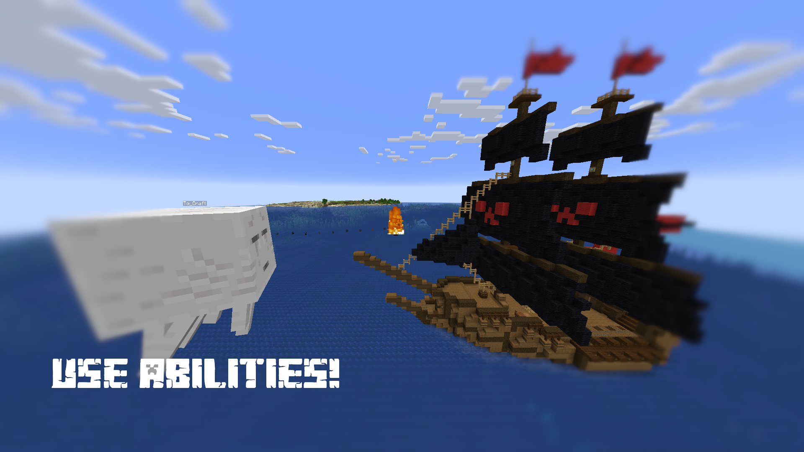
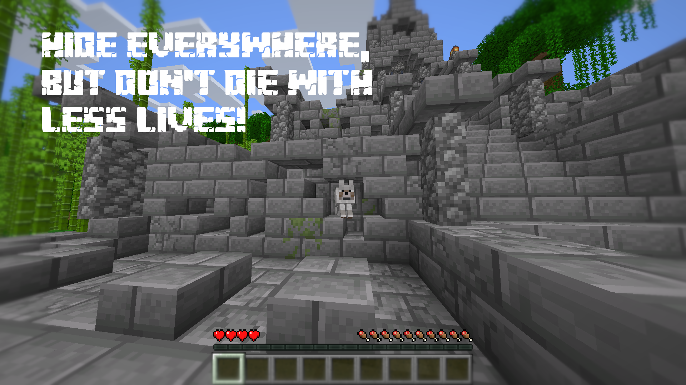

# Woodwalkers

*Become your favourite mob — and live as one.*

Woodwalkers lets you choose a second shape and transform into it at will. Walk over lava as a Strider, explore caves as a Bat, or terrorize your friends as a Ghast. Nearly every mob comes with unique traits and abilities that make each form feel genuinely different.

Woodwalkers is also the foundation for addon mods like [ReMorphed](https://modrinth.com/mod/remorphed), which extends it with kill-to-unlock progression and a full morph menu.

---

## Features

**Passive Traits** — each mob form changes your stats: health, size, movement, and more match the mob you've become. Your nametag disappears too, so no one can tell you apart from the real thing.

**Active Abilities** — forms come with active abilities, not just passive effects. What you can do depends on the mob.

**Deep Configuration** — blacklists for mobs, abilities, and traits. API-level events and hooks let modpack makers and developers control exactly what Woodwalkers does in their environment.

**Broad Compatibility** — supports Fabric, Forge, NeoForge, and Quilt across a wide range of Minecraft versions.

---

## Getting Started

Find the mob you want to become in the world. Look directly at it and hold the **Scan Key** (default: `U`) for 5 seconds. You'll see *"You feel it tingle"* — that's your second shape locked in.

Press the **Transform Key** (default: `G`) at any time to switch between your player form and your mob form.

> ⚠️ **Your second shape is permanent by default.** Choose carefully. An OP command and a config option exist to reset it on death if you prefer.

---

## For Modpack Makers & Developers

Woodwalkers exposes a full API with:
- Passive trait registration
- Active ability registration
- Blacklists for mobs, traits, and abilities
- API-level events to enable/disable parts of the mod per your needs

See the [Wiki](https://github.com/ToCraft/woodwalkers-mod/wiki/Registering-Traits) for full documentation.

---

## Want Kill-to-Unlock and a Morph Menu?

Install **[ReMorphed](https://modrinth.com/mod/remorphed)** — it replaces the scan mechanic with a kill-to-unlock system, adds a full morph menu, and lets you collect unlimited shapes.

---

## Requirements

| Mod | CurseForge | Modrinth |
|---|---|---|
| CraftedCore | [Download](https://www.curseforge.com/minecraft/mc-mods/crafted-core) | [Download](https://modrinth.com/mod/crafted-core) |

## Download

## How can I support this project?

You could donate via [Patreon](https://www.patreon.com/tocraft).
Alternatively, if you want to contribute to this mod, I'm always happy about someone who translates this mod to other
languages or tells me about bugs/issues.
Everyone who helps a lot with dev-work will get a new texture as wolf which is enabled by pressing `V` (This key is only
visible to Developer and Patreons).

---

*Lore-inspired by the novel [Woodwalkers](https://www.katja-brandis.de/2016/05/11/woodwalkers/) by Katja Brandis.*

## License

Woodwalkers is licensed under [MIT](https://github.com/ToCraft/woodwalkers-mod/blob/main/LICENSE).